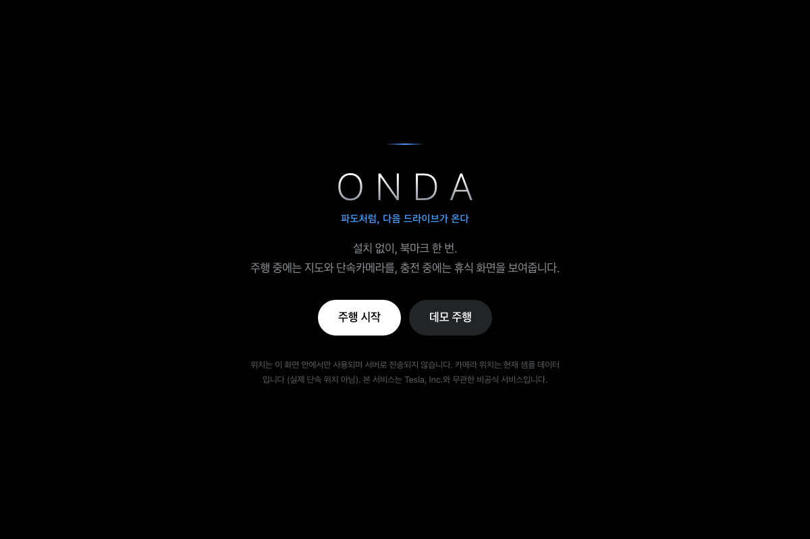
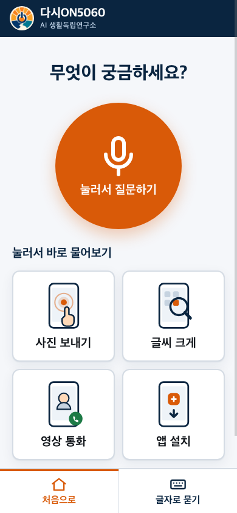

# Derrick Hwang

### AI Product Builder

사용자의 불편에서 출발해 제품을 만들고, 실제 작동하는지 확인합니다.
음성 인터페이스, 콘텐츠 자동화, 개인 지식 시스템을 설계하고 운영합니다.

[제품 살펴보기](#제품) · [검증 기록](VERIFICATION.md) · [GitHub](https://github.com/kordp888)

## 제품

### ONDA · 차량 브라우저의 주행 경험

앱 설치 없이 차량 브라우저에서 진입하는 음성 중심 인터페이스입니다.
주행과 정차 상황에 맞춰 필요한 정보를 찾는 동선을 설계했습니다.

**설계 판단**  센서 입력이 불안정할 때의 동작과 음성 안내의 경계를 함께 다룹니다.
화면은 보관된 제품 시안이며 현재 실차 동작이나 출시 승인을 증명하지 않습니다.

### 다시ON5060 · 한 번에 한 단계

디지털 서비스가 낯선 사용자가 음성으로 질문하고 다음 행동을 찾는 인터페이스입니다.
큰 질문 버튼과 사진 보내기·글씨 크게 보기 같은 생활 과제를 앞에 배치했습니다.

**설계 판단**  기능 수보다 다음 행동을 알아볼 수 있는지를 먼저 봅니다.
이 화면만으로 고령 사용자 대상 사용성 검증이 완료됐다고 주장하지 않습니다.

### 콘텐츠 자동화 · 생성 이후의 확인

자료 수집, 원고, 음성, 영상, 검수의 연결을 다룹니다.
생성 결과의 수치·출처·상태를 확인하고, 실패 시 마지막 성공 단계를 남기는 운영 방식을 설계합니다.
구현 코드와 제작 원본은 비공개로 관리합니다.

### LLM Wiki · 다시 사용할 수 있는 지식

프로젝트별 참고자료와 결정 기록을 모으고 작업에 필요한 문맥을 선택합니다.
자료를 저장한 사실과 실제로 다음 작업에 반영된 사실을 구분해 검증합니다.

### Signal Crew · 오늘의 작업을 한곳에

할 일과 진행 상태, 협업의 맥락을 한 화면에서 파악하는 제품을 개발합니다.
개인·팀 데이터가 담길 수 있는 운영 화면은 이 포트폴리오에 싣지 않습니다.

## 검증으로 남기는 것

| 확인 대상 | 이번 공개 기록 |
|---|---|
| 프로젝트 문맥 선택 | 세 프로젝트에서 각 관리 문서가 한 번씩 선택되는지 확인 |
| 복사한 자료의 지속성 | 임시 원본이 없어도 관리 사본이 로드되는 회귀 검사 |
| 운영 도구 검증 | 2026-09-09 로컬 테스트 113개 통과, 실패 0개 |

위 수치는 해당 시점의 기술 검사입니다. 사용자 만족도나 사업 성과를 뜻하지 않습니다.
검사 범위와 한계는 [검증 기록](VERIFICATION.md)에 적었습니다.

## 일하는 방식

해결할 문제와 관찰할 결과부터 정합니다. 작은 동작을 만들고 실제 사용 조건에서
확인합니다. 실패하면 원인과 바뀐 판단을 기록해 다음 작업의 시작점으로 삼습니다.

제품 기획 · 사용자 흐름 설계 · AI 파이프라인 · 음성 UX · 품질 검증 · 운영 자동화

---

이 저장소는 소개, 선별한 화면, 검증 요약만 공개합니다.
서비스 코드, 프롬프트, 내부 자료, 원본 로그 및 고객 데이터는 포함하지 않습니다.
