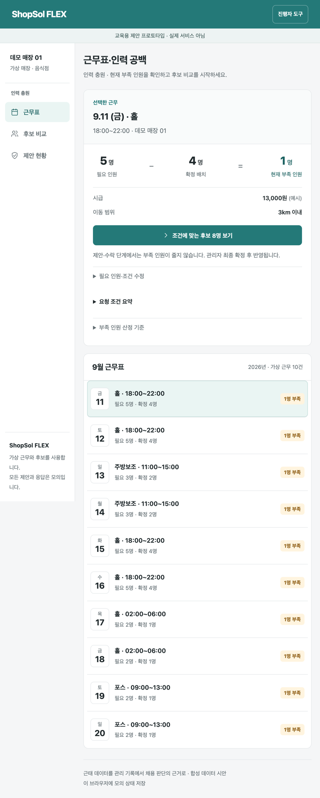

# Derrick Hwang

### AI Product Builder

음성 인터페이스와 콘텐츠 자동화, 개인 지식 시스템을 만듭니다. 만든 다음에는 실제 조건에서
돌려보고, 어디까지 확인됐고 어디부터가 아직인지를 함께 적어둡니다.

[제품 살펴보기](#제품) · [검증 기록](VERIFICATION.md) · [GitHub](https://github.com/kordp888)

## 제품

### WESOP · ShopSol FLEX

금요일 저녁 홀 근무에 한 명이 빕니다. 누구에게 제안할지, 그리고 언제부터 그 자리를 채워진 것으로
봐야 할지가 이 프로토타입의 질문입니다.

부족 인원 확인에서 후보 비교와 제안을 거쳐 모의 수락, 준비 확인, 관리자 확정까지 이어집니다.
관리자 화면 3개와 근로자 응답 모의화면이 붙어 있습니다. 제안하거나 수락하는 것만으로는
부족 인원이 줄지 않게 했습니다. 관리자가 확정해야 반영됩니다.

[프로토타입 열기](https://wesop-shopsol-prototype.vercel.app/)

쓰는 데이터는 전부 합성입니다. 실제 샵솔 연동이나 채용, AI 추천은 들어 있지 않습니다.
2026-09-09에 보관한 기록으로는 단위·빌드 검사 58개와 공개 HTTPS 브라우저 검사 278개가
통과했는데, 서로 다른 실행이라 더해서 쓰지 않습니다. 참여자를 받은 적이 없어 사용자 가설은
NOT_RUN이고 실기기 검사와 현장 채용 성과도 아직입니다. 구현 저장소는 비공개입니다.

### ONDA · 차량 브라우저의 주행 경험

앱을 깔지 않고 차량 브라우저에서 바로 들어갑니다. 운전 중에는 손이 자유롭지 않으니 음성을
앞에 뒀고, 달릴 때와 세워둘 때 필요한 정보가 다르다는 전제로 동선을 짰습니다.

까다로웠던 건 센서 입력이 흔들릴 때였습니다. 위치가 확실하지 않은 상태에서 안내를 이어갈지
멈출지, 그 경계를 정하는 일이 설계의 대부분이었습니다. 위 화면은 2026-09-10에 현재 빌드를
데모 주행 모드로 띄워 캡처했습니다. 좌표와 단속 정보가 모의 데이터라 실차 주행이나 출시
승인을 뜻하지는 않습니다.

### 다시ON5060 · 한 번에 한 단계

디지털이 낯선 분들이 음성으로 묻고 다음에 뭘 눌러야 할지 찾는 화면입니다. 큰 질문 버튼을
맨 위에 두고, 사진 보내기나 글씨 크게 보기처럼 자주 막히는 과제를 앞으로 뺐습니다.

기능을 몇 개 넣었는지는 여기서 기준이 아니었습니다. 처음 보는 사람이 다음 행동을 알아보는지가
기준이었습니다. 2026-09-10 현재 빌드를 캡처한 화면이고, 고령 사용자 사용성 결과는 아직 없습니다.

### 콘텐츠 자동화 · 생성 이후의 확인

자료 수집부터 원고, 음성, 영상, 검수까지 이어 붙였습니다. 정작 손이 많이 간 쪽은 생성이 아니라
그 다음이었습니다. 나온 결과의 수치와 출처가 맞는지 보고, 중간에 실패하면 어느 단계까지
성공했는지를 남겨 거기서 다시 시작할 수 있게 했습니다. 구현 코드와 제작 원본은 비공개입니다.

### LLM Wiki · 다시 쓰이는 지식

프로젝트마다 흩어진 참고자료와 결정 기록을 모아두고, 새 작업을 시작할 때 필요한 것만 골라 옵니다.
검증할 때는 자료가 저장됐다는 사실과 그게 실제로 다음 작업에 쓰였다는 사실을 따로 봅니다.
쌓아두기만 한 자료는 없는 것과 크게 다르지 않아서입니다.

### Signal Crew · 오늘의 작업을 한곳에

할 일과 진행 상태, 주고받은 맥락을 한 화면에서 읽는 제품입니다. 개인이나 팀의 업무 내용이
그대로 보이는 운영 화면이라 여기에는 싣지 않았습니다.

## 검증으로 남기는 것

| 확인 대상 | 이번 공개 기록 |
|---|---|
| 프로젝트 문맥 선택 | 세 프로젝트에서 각 관리 문서가 한 번씩 선택되는지 확인 |
| 복사한 자료의 지속성 | 임시 원본이 없어도 관리 사본이 로드되는 회귀 검사 |
| 운영 도구 검증 | 2026-09-09 로컬 테스트 113개 통과, 실패 0개 |

그 시점의 기술 검사 결과입니다. 사용자가 만족했다거나 사업 성과가 났다는 뜻은 아닙니다.
무엇을 얼마나 확인했고 무엇이 빠졌는지는 [검증 기록](VERIFICATION.md)에 적어뒀습니다.

## 일하는 방식

풀려는 문제와, 무엇을 보고 됐다고 판단할지를 먼저 정합니다. 그 다음 제일 작은 동작 하나를
실제 조건에서 돌려봅니다. 실패하면 원인과 그때 바뀐 판단을 적어 다음 출발점으로 씁니다.
이 순서가 흔들리면 만든 건 늘어나는데 확인된 건 그대로입니다.

---

이 저장소에는 소개와 선별한 화면, 검증 요약만 있습니다. 서비스 코드와 프롬프트, 내부 자료,
원본 로그, 고객 데이터는 들어 있지 않습니다.
